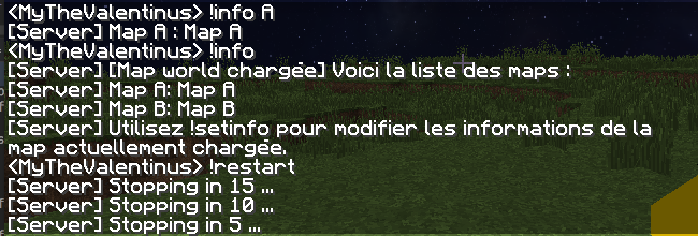

## Minecraft chat bot

Minecraft chat bot written in python that parse latest logs from server and execute action called by user in game.

### Requirements
- UNIX system
- Programm: `python3`, `tail`, `screen`

### How to run

Launch `start.py` : `python start.py`
You can launch this script in a screen to detach and re-attach when youl'd like

By default the script launch minecraft server when it's start

### Crontibutors
@Warths for the idea and code help

### License
License GPLV3