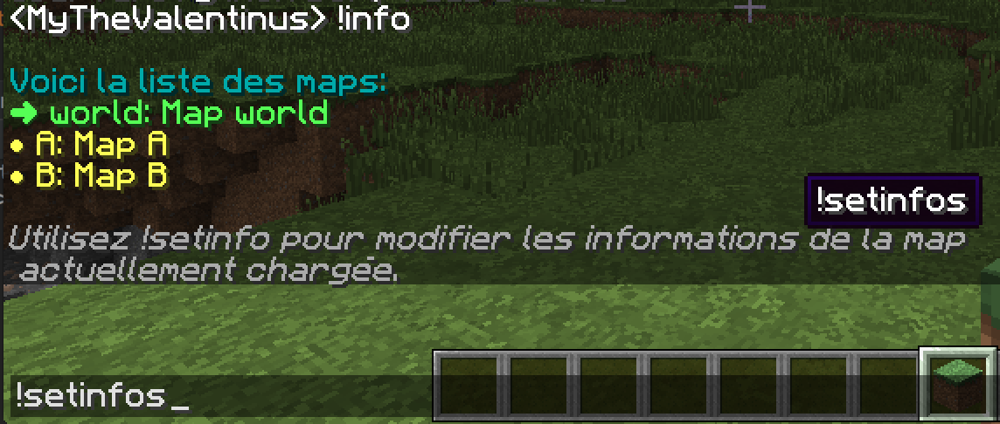
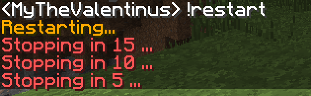

## Minecraft chat bot

Minecraft chat bot written in python that parse latest logs from server and execute action called by user in game.

### Requirements
- UNIX system
- Programm: `python3`, `tail`, `screen`
- `pip install -U -r requirements.txt`

### How to run

Launch `start.py` : `python start.py`
You can launch this script in a screen to detach and re-attach when youl'd like

This script start screen with minecraft server by default, to disable this features and do not launch minecraft server when script boot up, pass `START_SERVER_AT_BOOT` to `False` in `config.py`

### Base commands
| Command | Argument | Action |
| --- |---| --- |
| info || Retrieve list of map and their descriptions |
| setinfo | (description) | Set description of current map |
| swap | (map_id) | Permet de changer de map |
| setsrvparam | (key, value) | Permet de changer une config du server.properties |
| stop || Stop mc server |
| restart || Restart mc server |
| stopall || Stop mc and python script |

### Crontibutors
@Warths for the idea and code help

### License
License GPLV3